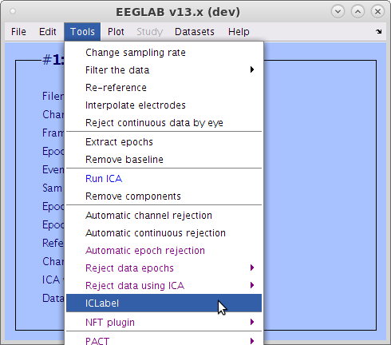
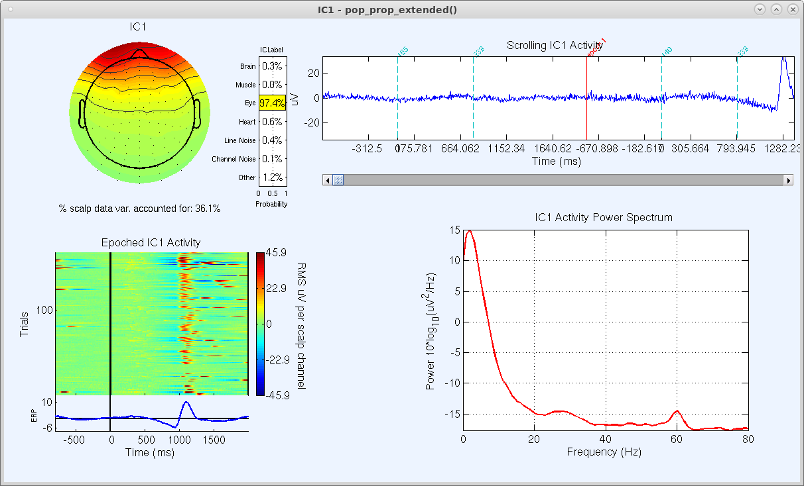

To view the plugin source code, please visit the plugin's [GitHub repository](https://github.com/sccn/ICLabel).

# ICLabel
An automatic EEG independent component classifer plugin for EEGLAB.
For more information, see [the ICLabel website tutorial](https://labeling.ucsd.edu/tutorial/about).

## Installation
The easiest way to get the ICLabel plugin is through the EEGLAB plugin manager. 

If you plan to install the plugin through GitHub rather than the EEGLAB plugin manager, be aware that matconvnet is included as submodule. This means that it will no be included in the zip-file download. You will have to download [my fork (version) of matconvnet](https://github.com/lucapton/matconvnet) and extract that zip into the ICLabel folder. Alternatively, if you are cloning this repository through the command line, be sure to include the "--recusive" flag to clone submodules as well. Once you are in the desired directory, the correct command is:

git clone --recursive https://github.com/lucapton/ICLabel.git

## Usage
### Graphical Usage

Once you finish installing ICLabel, of if you already have it installed, you need to load your EEG dataset. To run ICLabel, your dataset must already have been decomposed using independent component analysis.

With your dataset loaded, start ICLabel using the EEGLAB window by clicking on "Tools"->"ICLabel". You will see progress notes displayed on MATLAB's command window as ICLabel's pipeline progresses. When ICLabel finishes, it will display "Done" on MATLAB's command window and the Viewprops plug-in will open if available. If you do not have "Viewprops" installed, then nothing else will appear on the screen.

### Command-line Usage
Assuming you have stored your ICA-decomposed EEG dataset in the variable EEG, you can use ICLabel by entering the following into MATLAB's command window:
```
EEG = iclabel(EEG)
```
### Finding Results
Either way you use ICLabel, from the EEGLAB window or MATLAB's command window, the IC classification information is saved to the EEG structure in the matrix:
```
EEG.etc.ic_classification.ICLabel.classifications
```
The labels are stored as a matrix in which each row is a label vector for the corresponding IC. A label vector is a row of seven numbers, summing to one, which represent the probabilities that an IC being in any of the seven ICLabel IC categories. For example, to find the label vector for the fifth IC, reference the fifth row of the matrix:
```
EEG.etc.ic_classification.ICLabel.classifications(5, :)
```
You can also find the class labels in the cell array of strings:
```
EEG.etc.ic_classification.ICLabel.classes
```
Each element of the cell array of strings indicates the category of the corresponding element in the label vectors. For example, to find the category of the third element in the label vector:
```
EEG.etc.ic_classification.ICLabel.classes{3}
```
You will find the category is "eye."
## Viewprops plug-in

The ICLabel plugin offers no built-in plotting or visualization; therefore, it is highly suggested that you also install the [Viewprops plug-in](https://sccn.ucsd.edu/wiki/Viewprops). It will produce figures like the one shown at the top of this article. See the [Installation](https://sccn.ucsd.edu/wiki/ICLabel#Installation) section for directions on how to acquire the [Viewprops plug-in](https://sccn.ucsd.edu/wiki/Viewprops) and see [its wiki page](https://sccn.ucsd.edu/wiki/Viewprops) for information on how to use it.

### Run ICLabel in Fieldtrip

First install EEGLAB (it includes the ICLabel plugin by default). Then use the script below.

```matlab
cfg = [];
cfg.datafile = '~/data/matlab/eeglab/sample_data/eeglab_data.set';
cfg.headerfile = '~/data/matlab/eeglab/sample_data/eeglab_data.set';
my_ft_data = ft_preprocessing(cfg);

eeglab; close; % add paths to EEGLAB
EEG = fieldtrip2eeglab(my_ft_data, my_ft_data.trial);
EEG = eeg_checkset(EEG);
EEG = pop_runica(EEG, 'icatype', 'runica');
EEG = pop_icflag(EEG, [0 0;0 0; 0.001 1; 0 0; 0 0; 0 0; 0 0]); % see function help message
rejected_comps = find(EEG.reject.gcompreject > 0);
EEG = pop_subcomp(EEG, rejected_comps);
EEG = eeg_checkset(EEG);

curPath = pwd;
p = fileparts(which('ft_read_header'));
cd(fullfile(p, 'private'));
hdr = read_eeglabheader( EEG );
data = read_eeglabdata( EEG, 'header', hdr );
event = read_eeglabevent( EEG, 'header', hdr );
cd(curPath);
```

## Version history
Pending - new message if signal processing toolbox is absent (we judged a new release was not necessary for such a small change)

1.6 - fix issue with electrode orientation introduced in version 1.5 one month prior

1.5 - minor tweaks and better stability (see commit history)

1.4 - adding 'average' to the list of possible reference for EEGLAB compatibility

1.3 - make sure the classification probabilities are identical when processing multiple datasets with the same ICA decompositions

1.2.6 - fix issue in pop_iclabel.m for Matlab prior to 2016, fix rare path issue and issue with autocorrelation length

1.2.5 - fix issue when pressing cancel in pop_iclabel.m

1.2.4 - Forgot to include some dependencies in 1.2.3, adding them back and fix issue to view properties

1.2.3 - Fix bug for single dataset

1.2.2 - Fix STUDY calling format and add new function eeg_icalabelstat
