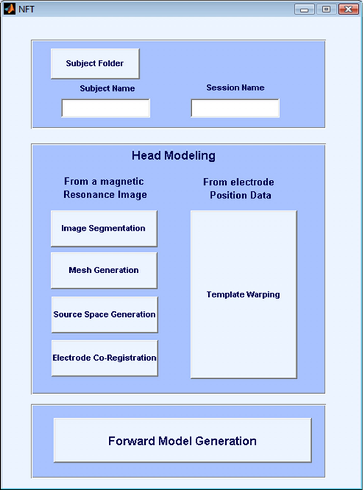

Introduction
------------

The Neuroelectromagnetic Forward Head Modeling Toolbox is an open-source
software toolbox running under MATLAB (The Mathworks, Inc.) for
generating realistic head models from available data (MRI and/or
electrode locations) and for solving the forward problem of
electro-magnetic source imaging. The toolbox includes tools for
segmenting scalp, skull, cerebrospinal fluid (CSF) and brain tissues
from T1-weighted magnetic resonance (MR) images. After extracting the
segmented tissue volumes, mesh generation can be performed. When MR
images are not available, it is possible to warp a template head model
to measured electrode locations to obtain a better-fitting head model.
The toolbox also includes electrode scalp mesh co-registration and
generation of a uniform source space inside the brain volume for to be
used in coarse source localization. The Boundary Element Method (BEM) is
used for the numerical solution of the forward problem. Toolbox
functions can be called from either a graphic user interface or from the
command line. Function help messages and a tutorial are included. The
toolbox is freely available under the GNU Public License for
noncommercial use and open source development.

The toolbox uses the following third party tools and libraries for
segmentation, mesh generation and forward problem solution. The source
codes for these tools are available.

1\. ASC - for triangulation of 3D volumes.

2\. Qslim - for mesh coarsening.

3\. Matitk - Matlab interface to the ITK image processing toolkit.

4\. Metu-bem - Boundary Element Method solver.

The NFT toolbox provides a user interface (UI) for segmentation, mesh
generation and for creating the numerical head model. It also has a well
defined MATLAB command-line interface.

This manual explains how to use the NFT toolbox. The head modeling UI,
the command line API and the structures are described. An overview of
the implementation is provided.

The next section describes the installation of the toolbox. The Getting
Started section provides an overview of the interface. Head modeling
from 3D MR images is described next, followed by head modeling from
template warping. This is followed by a section on forward modeling and
examples. The [final
section](Chapter_05_NFT_Commands_and_Functions "wikilink") is a
summary of all toolbox functions and commands.

Installation and Configuration
------------------------------

This section describes installation and configuration of the NFT
Toolbox. The following steps are necessary for a proper installation of
the toolbox:

1\. Extract or copy the toolbox directory to a suitable place on your
computer file system.

2\. The extracted directory will contain m-files, and C++ executables.

3\. Add the toolbox directory to the MATLAB path. You can use the File →
SetPath menu item or the addpath() function. Under linux/unix, you may
add the directory to the MATLABPATH.

The toolbox can also make use of the Matlab Parallel Processing toolbox
(if installed) to distribute the computation of the transfer and
lead-field matrices to multiple processors. To do this, before running
NFT, the user must simply enter

\>\> matlabpool(n) % where n is the number of compute nodes available

In parallel mode, wait bars do not appear while computing the transfer
and lead-field matrices.

Getting Started
---------------

The toolbox starts by typing
Neuroelectromagnetic_Forward_Modeling_Toolbox or NFT on command window.
Main window appears as shown in Figure 1. This window is divided into
three panels. The first panel is used to select the working folder, and
to name the subject and the session. The NFM toolbox requires a subject
folder to be specified at startup. All subject specific output is saved
into this folder. The filenames are derived from the subject and session
names entered into this panel. The second panel is the Head modeling
panel. The head model can either be created from MR images, or a
template head model can be warped to digitized sensors. The head
modeling panel provides the following operations when creating a head
model from MR images:

**Image Segmentation**

Interface for tissue classification from 3D MR Images.

**Mesh Generation**

Uses the segmentation results to generate realistic BEM meshes.

**Source Space Generation**

Generates a regular grid sources within the brain mesh.

**Electrode Co-Registration**

Registers digitized electrode locations to the scalp mesh.

When generating a template-based head model from digitized electrode
positions, the only option is Template Warping. The final panel in the
main menu is for Forward Model Generation. This opens up the Forward
Model Generation interface which is used to compute the BEM coefficient
matrix, create the transfer matrices for each sensor, and generate lead
field matrices for a source distribution.
