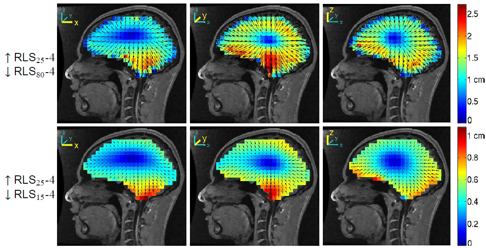

Effect of brain-to-skull conductivity ratio estimate on EEG source localization
-------------------------------------------------------------------------------

An important consideration for obtaining accurate forward problem
solutions is to correctly model the distribution of conductivity within
the head. In the literature, consistent conductivity values have been
reported for scalp, brain, and CSF tissues but there has been a huge
variation in reported skull conductivity values. This is partly caused
by variations in skull conductivity from person to person and throughout
the life cycle (Hoekema et al 2003), and partly from use of different
measurement/estimation methods (Oostendorp et al 2000). In the 1970's
and 80's the brain-to-skull conductivity ratio was reported to be 80
(Rush 1968, Cohen 1983), still a very commonly used ratio in EEG source
localization. More recent studies in the last decade have reported this
ratio to be as low as 15 (Oostendorp 2000). In a more recent study on
epilepsy patients undergoing presurgical evaluation using simultaneous
intra-cranial and scalp EEG recordings, the average brain-to-skull
conductivity ratio was estimated to be 25 (Lai 2005).

Below, we present some simulation results showing the effects of using
incorrect skull conductivity values on equivalent dipole source
localization. For this purpose, we solved the forward electrical head
model problem using a realistic, subject-specific four-layer BEM model
built from a subject’s MR head image using the NFT toolbox (Akalin Acar
& Makeig, 2010). We set the forward model (‘ground truth’)
brain-to-skull conductivity ratio to 25 and then solved the inverse
problem using the same realistic head model using the commonly used
ratio of 80. This produced equivalent dipole localization errors of up
to 2.5 cm (figure below, top row). The positions of the grid of model
dipoles were moved towards the scalp surface. On the other hand, (figure
below, bottom row) if the brain-to-skull conductivity ratio was
mis-estimated to be 15 when solving the inverse problem, the dipoles
were localized more towards the center of the brain with localization
errors up to 1 cm (Akalin Acar & Makeig, 2012). Therefore, correct
modeling of skull conductivity is an important factor for EEG source
localization.

Figure 1. Equivalent dipole source localization error directions
(arrows) and magnitudes (colors) for a 4-layer realistic BEM head model
when the brain-to-skull conductivity ratio was estimated to be 80 as
opposed to the actual simulated forward model value of 25 (top row) and
as 15 (as opposed to 25) (bottom row). The source space was a regular
Cartesian grid of single equivalent dipole sources with 8-mm spacing
filling the brain volume. The three columns show the errors when the
equivalent dipole sources are oriented in x-, y-, and z-directions,
respectively.