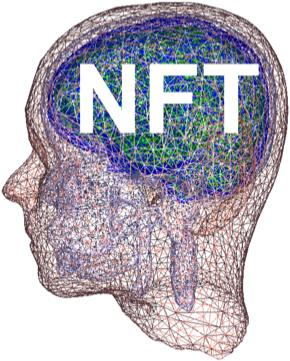

### Open Source Matlab Toolbox for Neuroelectromagnetic Forward Head Modeling

### What is NFT?

Neuroelectromagnetic Forward Modeling Toolbox (NFT) is a MATLAB toolbox
for generating realistic head models from available data (MRI and/or
electrode locations) and for computing numerical solutions for solving
the forward problem of electromagnetic source imaging (Zeynep Akalin
Acar & S. Makeig, 2010). NFT includes tools for segmenting scalp, skull,
cerebrospinal fluid (CSF) and brain tissues from T1-weighted magnetic
resonance (MR) images. The Boundary Element Method (BEM) is used for the
numerical solution of the forward problem. After extracting the
segmented tissue volumes, surface BEM meshes may be generated. When a
subject MR image is not available, a template head model may be warped
to 3-D measured electrode locations to obtain an individualized BEM head
model. Toolbox functions can be called from either a graphic user
interface (gui) compatible with EEGLAB (sccn.ucsd.edu/eeglab), or from
the MATLAB command line. Function help messages and a user tutorial are
included. The toolbox is freely available for noncommercial use and open
source development under the GNU Public License.

### Why NFT?

The NFT is released under an open source license, allowing researchers
to contribute and improve on the work for the benefit of the
neuroscience community. By bringing together advanced head modeling and
forward problem solution methods and implementations within an easy to
use toolbox, the NFT complements EEGLAB, an open source toolkit under
active development. Combined, NFT and EEGLAB form a freely available EEG
(and in future, MEG) source imaging solution.

The toolbox implements the major aspects of realistic head modeling and
forward problem solution from available subject information:

1.  Segmentation of T1-weighted MR images: The preferred method of
    generating a realistic head model is to use a 3-D whole-head
    structural MR image of the subject's head. The toolbox can generate
    a segmentation of scalp, skull, CSF and brain tissues from a
    T1-weighted image.

2.  High-quality BEM meshes: The accuracy of the BEM solution depends on
    the quality of the underlying mesh that models tissue
    conductance-change boundaries. To avoid numerical instabilities, the
    mesh must be topologically correct with no self-intersections. It
    should represent the surface using high-quality elements while
    keeping the number of elements as small as possible. The NFT can
    create high-quality linear surface BEM meshes from the head
    segmentation.

3.  Warping a template head model: When a whole-head structural MR image
    of the subject is not available, a semi-realistic head model can be
    generated by warping a standard template BEM mesh to the digitized
    electrode coordinates (instead of vice versa).

4.  Registration of electrode positions with the BEM mesh: The digitized
    electrode locations and the BEM mesh must be aligned to compute
    accurate forward problem solutions and lead field matrices.

5.  Accurate high-performance forward problem solution: The NFT uses a
    high-performance BEM implementation from the open source METU-FP
    Toolkit for bioelectromagnetic field computations.

### Required Resources

Matlab 7.0 or later running under any operating system (Linux, Windows).
A large amount of RAM is useful - at least 2 GB (4-8 GB recommended for
forward problem solution of realistic head models). The Matlab Image
Processing toolbox is also recommended.

### NFT Reference Paper

Zeynep Akalin Acar & Scott Makeig, [Neuroelectromagnetic Forward Head
Modeling
Toolbox](http://sccn.ucsd.edu/%7Escott/pdf/Zeynep_NFT_Toolbox10.pdf).
<em>Journal of Neuroscience Methods</em>, 2010

Download
--------

To download the NFT, go to the [NFT download
page](http://sccn.ucsd.edu/nft/).

NFT User's Manual
-----------------

-   [Chapter 01: Getting Started with NFT](Chapter_01_Getting_Started_with_NFT "wikilink")
-   [Chapter 02: Head Modeling from MR Images](Chapter_02_Head_Modeling_from_MR_Images "wikilink")
-   [Chapter 03: Forward Model Generation](Chapter_03_Forward_Model_Generation "wikilink")
-   [Chapter 04: NFT Examples](Chapter_04_NFT_Examples "wikilink")
-   [Chapter 05: NFT Commands and Functions](Chapter_05_NFT_Commands_and_Functions "wikilink")
-   [Appendix A: BEM Mesh Format](NFT_Appendix_A)
-   [Appendix B: Function Reference](NFT_Appendix_B)
-   [Appendix C: Effect of brain-to-skull conductivity ratio estimate](NFT_Appendix_C)

-   [Click here to download the NFT User Manual as a PDF book](NFT_Tutorial.pdf)

Creation and documentation by:

Zeynep Akalin Acar

Project Scientist

zeynep@sccn.ucsd.edu

