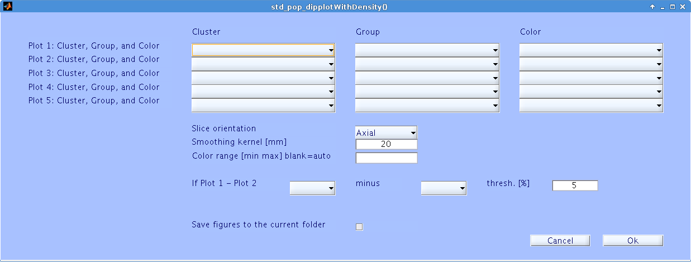
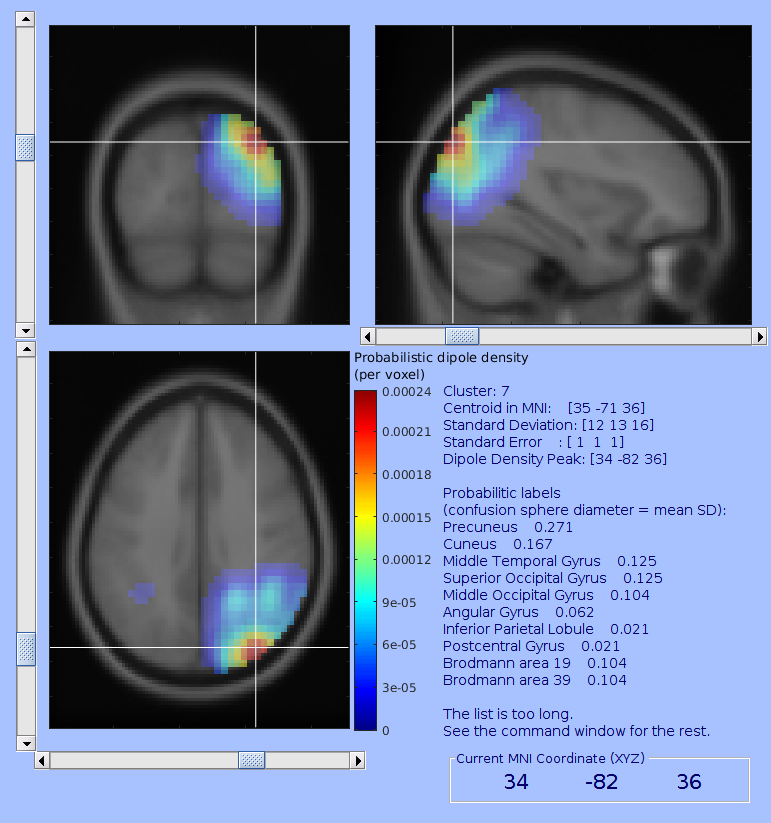

To view the plugin source code, please visit the plugin's [GitHub repository](https://github.com/sccn/std_dipoleDensity).

# STUDY dipole density EEGLAB plugin

DipoleDensity, called by the function std_dipplotWithDensity or in the
EEGLAB gui under Study-\>"Plot group dipoles with density", is a
visualization tool for dipole clusters within a study set. This function
will present three different visualizations of selected clusters to
better understand their distributions throughout the brain (the clusters
must already be computed). 

Note that it is possible to plot Dipole Density directly from the EEGLAB Study plot. However, this plugin offers additional functionalities. 

The interface is shown here:

Each row of "Cluster"/"Group"/"Color" can plot a separate cluster and
any left blank will be ignored. The inputs work as follow:

|                   |                                                                                                                                                                                                                                                                                                                                                                                              |
|-------------------|----------------------------------------------------------------------------------------------------------------------------------------------------------------------------------------------------------------------------------------------------------------------------------------------------------------------------------------------------------------------------------------------|
| Cluster           | Select a cluster to be plotted                                                                                                                                                                                                                                                                                                                                                               |
| Group             | Select a subgroup of the cluster to plot based on study conditions                                                                                                                                                                                                                                                                                                                           |
| Color             | Select a color to represent the corresponding cluster in the 3D dipole plot (third image in the lower table)                                                                                                                                                                                                                                                                                 |
| Slice orientation | Select the orientation in which the MRI is sliced for the tiled dipole density plot (first image in the tabel below)                                                                                                                                                                                                                                                                         |
| Smoothing kernal  | Select the width in mm to blurr each dipole. Default is 20mm, although that is quite heavy. 10mm provides a nice tradeoff between resolution and cluster visability. Trying multiple values here is highly suggested. This affects both the tiled and interactive images (first and second images in the lower table).                                                                       |
| Slice orientation | Select the orientation in which the MRI is sliced for the tiled dipole density plot                                                                                                                                                                                                                                                                                                          |
| Color range       | Select the range of values to show in the tiled dipole density plot. To select a useful range of values, it is helpful to first plot the figures with an automatic range and then look at the colorbar. The values are quite small as the dipole density values are normalized such that the voxels of the brain sum to 1. This will affect the Interactive plot as well in a later version. |
| Plot 1 - Plot 2   | If groups are selected in the dropdown menu, a second version of the tiled dipole density figure showing the the difference in dipole densities between the groups will be created. The difference will be thresholded by using the valuethe given Thresh. The thresholding is done using uncorrected p-valuel.                                                                              |
| Save plot         | If checked, saves all plots excluding the interactive dipole density figures.                                                                                                                                                                                                                                                                                                                |

The plots provided are shown below:

<table>
<tbody>
<tr class="odd">
<td>
Tiled dipole density plot: Each cluster selected will create a tiled image of MRI slices showing the cluster densities. The orientation of the slices is chosen using "Slice Orientation" in the original pop-up interface.
</td>
<td>

</td>
</tr>
<tr class="even">
<td>
Interactive dipole density plot: This figure contains the same information as in the tiled dipole density plot. the interface allows the slice locations to be shifted in real time to allow for a more intuitive egometric understanding of dipole density locations.
</td>
<td>

</td>
</tr>
<tr class="odd">
<td>
3D dipplot: All the dipoles from the selected clusters and groups are presented in 3D. Each cluster/group is marked by the color chosed in the user interface.
</td>
<td>

</td>
</tr>
</tbody>
</table>

Note: Another use of this function could be to estimate the number of
clusters to group dipoles into; although, to do so you must first create
a cluster containing all dipoles. Eventually, this will be integrated as
an option so that the extra clustering step is not necessary for this
initial analysis.

Authors: Luca Pion-Tonacini and Makoto Miyakoshi. SCCN, INC, UCSD. The function to show tiled dipole plots (mir3dplot) was written by Arnaud Delorme.

# Version history

## Version 0.40 Update (10/31/2018)

[Talairach daemon](http://www.talairach.org/index.html) (Lancaster et
al., 1997; Lancaster et al., 2000) is supported, via Christian Kothe's
function, to obtain anatomical location of the cluster centroid.
Standard deviation of the cluster centroid (the mean across x, y, and z
values) is used to determine the diameter of the confusion sphere. The
cursor's initial position is set to the voxel with the maximum dipole
density. Probabilistic dipole density is correctly scaled so that sum of
all the voxels == 1.

In using Talairach daemon, I prepared an exclusion criteria to exclude
non-EEG-generative areas that are included by default. For the Level3
outputs, the following list is applied. For the Level5 outputs, only
Brodmann areas are used. Only these two levels are used. The full list
of the Talairach daemon output can be found
[here](http://www.talairach.org/labels.html). The probabilities for
Level3 (anatomical names) and Level5 (Brodmann area numbers) are
calculated separately, so the sum of probability FOR EACH is 1. If you
add up Level3 and Level5 together, they will overlap each other and the
sum will be 2.

`      % Exclusion list--'x' means to exclude.`
`        Angular Gyrus`
`        Anterior Cingulate`
`      x Caudate`
`      x Cerebellar Lingual`
`      x Cerebellar Tonsil`
`        Cingulate Gyrus`
`      x Claustrum`
`      x Culmen`
`      x Culmen of Vermis`
`        Cuneus`
`      x Declive`
`      x Declive of Vermis`
`      x Extra-Nuclear`
`      x Fastigium`
`      x Fourth Ventricle`
`        Fusiform Gyrus`
`        Inferior Frontal Gyrus`
`        Inferior Occipital Gyrus`
`        Inferior Parietal Lobule`
`      x Inferior Semi-Lunar Lobule`
`        Inferior Temporal Gyrus`
`        Insula`
`      x Lateral Ventricle`
`      x Lentiform Nucleus`
`        Lingual Gyrus`
`        Medial Frontal Gyrus`
`        Middle Frontal Gyrus`
`        Middle Occipital Gyrus`
`        Middle Temporal Gyrus`
`      x Nodule`
`        Orbital Gyrus`
`        Paracentral Lobule`
`      x Parahippocampal Gyrus`
`        Postcentral Gyrus`
`        Posterior Cingulate`
`        Precentral Gyrus`
`        Precuneus`
`      x Pyramis`
`      x Pyramis of Vermis`
`        Rectal Gyrus`
`      x Subcallosal Gyrus`
`      x Sub-Gyral`
`        Superior Frontal Gyrus`
`        Superior Occipital Gyrus`
`        Superior Parietal Lobule`
`        Superior Temporal Gyrus`
`        Supramarginal Gyrus`
`      x Thalamus`
`      x Third Ventricle`
`        Transverse Temporal Gyrus`
`      x Tuber`
`      x Tuber of Vermis`
`      x Uncus`
`      x Uvula`
`      x Uvula of Vermis`

This is how the probabilistic labels are generated.

1.  You specify one point per IC cluster (the point where peak dipole
    probability is shown) in inside-brain space in MNI coordinate.
2.  You expand the point to a sphere with a radius that has the length
    of standard deviation of dipole locations (in x, y, and z--then the
    three SD values are averaged).
3.  The expanded 'sphere' now contains multiple spatial grid points,
    each of which has anatomical label. Now, let's say the current
    sphere contains 30 spatial grid points. If 10/30 points are assigned
    with 'medial PFC', then 10/30 = 33% of the anatomical label is
    associated with 'medial PFC'. If 7/30 points are assigned with
    'medial OFC', then 7/30 = 23.3% of the anatomical label is
    associated with 'medial OFC'. In this way, you list up all the
    unique anatomical labels, then counts how many points are associated
    with, then finally calculate the ratio against the total number of
    the points included.

## Update (05/26/2017)

Used and bug in calculating dual dipole (now selects the side by
obtaining the actual x coordinate values) fixed.

## Update (05/22/2017)

A cluster centroid is calculated only using one of the bilateral dipoles
on the side the centoid of the single dipoles exists.

## Update (03/16/2017)

When (symmetrical) two dipoles are fit bilaterally (using Caterina's
fitTwoDipoles plugin, for example), mean, standard deviation, and
standard error of dipole clusters are computed only using the one on the
same side of the cluster centroid. Visualization still uses two dipoles.

## Update (03/06/2017)

Now crosshair is supported on the interactive browser. Also, input for
the 3-D Gaussian kernel size was changed from sigma in Gaussian equation
to full-width half-maximum (FWHM) which is more standard in
neuroimaging. FWHM = sigma\*2.355.

## Update (09/13/2016)

Now it returns cluster centroid standard deviation and errors as
follows.
*Cluster: 3*
*Centroid in MNI: \[-29 -69 8\]*
*Standard Deviation: \[ 8 15 16\]*
*Standard Error : \[ 2 4 5\]*

